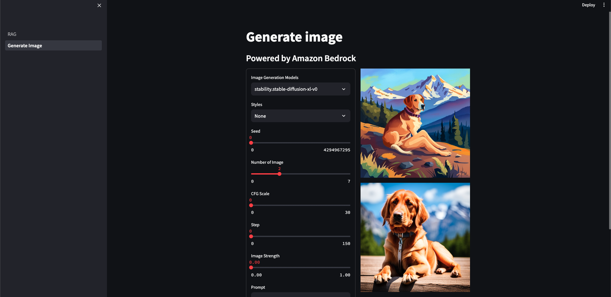
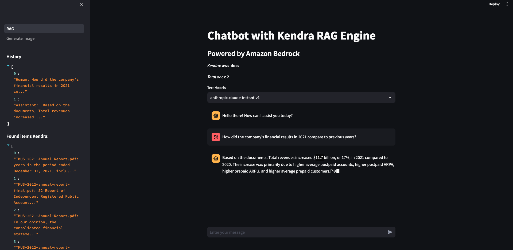

## App Overview

The simple app is a chat bot that incorporates two main functionalities: Kendra RAG and Generate Image with Bedrock (Stable Diffusion, Titan Image Generator).

### Kendra RAG

The chat bot utilizes Kendra RAG, which stands for Retrieval-Augmented Generation.

### Generate Image

The app also includes a feature to generate images. It uses the Bedrock model, specifically the Stable Diffusion and Titan Image Generator. This functionality allows users to generate images based on specific inputs or prompts.

## Configuring the App

To configure the app, you need to set the following environment variables in the `.env` file:

- `KENDRA_INDEX_ID`: This variable should be set to the ID of the Kendra index that you want to use for the Kendra RAG functionality. To create an index on the AWS Kendra service, please refer to the documentation [here](https://docs.aws.amazon.com/kendra/latest/dg/create-index.html).
- `MODEL_REGION`: This variable allows you to select the AWS Bedrock available region. For example: us-west-2.
- `AWS_PROFILE`: This variable should be set to the AWS profile that you want to use for authentication and authorization with AWS services.

Make sure to provide the appropriate values for these variables before running the app.

## Running the App Locally

To run the app locally, follow these steps:

1. Create a virtual environment:

```sh
python3 -m venv env
```

2. Activate the virtual environment:

```sh
source .env/bin/activate
```

3. Install the required dependencies:

```sh
pip install -r requirements.txt
```

4. Run the app:

```sh
streamlit run RAG.py
```

## Screenshots

Here are some screenshots of the app in action:



## To create a Kendra index and connect a data source (PDF, HTML, PowerPoints, Microsoft Word, FAQs, etc). 
1. Sign in to the Amazon Kendra console and choose "Create index" [(link)](https://console.aws.amazon.com/kendra/home)
2. Choose "Developer edition" and select "Create" to build the index. This process takes 15-30 minutes.
3. Once the index is active, you can add data sources like an S3 bucket or SharePoint site. In the navigation pane, select "Data sources" and then "Add data source".
4. Configure the data source by specifying details like the source endpoint URL or S3 path. Kendra will then automatically index the documents from this source.
5. Copy Kendra index id to the .env variable

### More information
1. [Create and query an index with Amazon Kendra](https://aws.amazon.com/getting-started/hands-on/create-query-index-with-amazon-kendra/)
2. [Getting started with the Amazon Kendra console - Amazon Kendra](https://docs.aws.amazon.com/kendra/latest/dg/gs-console.html)

